# [2026년 한이음 드림업 공모전] 26_HC122

<p align="center">
  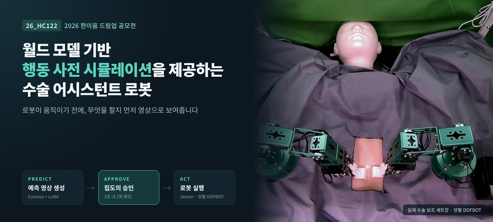<br>
  <b>Predict → Approve → Act</b><br>
  <sub>로봇이 움직이기 전에, 무엇을 할지 먼저 영상으로 보여주는 수술 어시스턴트 로봇</sub>
</p>

<p align="center">
  
  
  
  
  
  <br><a href="https://www.youtube.com/watch?v=k7HaMJAGI6U"></a>
</p>

---

## **💡1. 프로젝트 개요**

**1-1. 프로젝트 소개**
- **프로젝트 명** : 월드 모델 기반 행동 사전 시뮬레이션을 제공하는 수술 어시스턴트 로봇
- **프로젝트 정의** : 집도의의 음성 명령을 받으면 월드 모델(NVIDIA Cosmos)이 로봇 행동 이후의 미래 장면을 **실행 전에 영상으로 예측**하고, 집도의가 이를 검토·승인한 경우에만 양팔 로봇이 절개·개복 등의 수술 보조 동작을 수행하는 **Human-in-the-loop 수술 보조 시스템**

  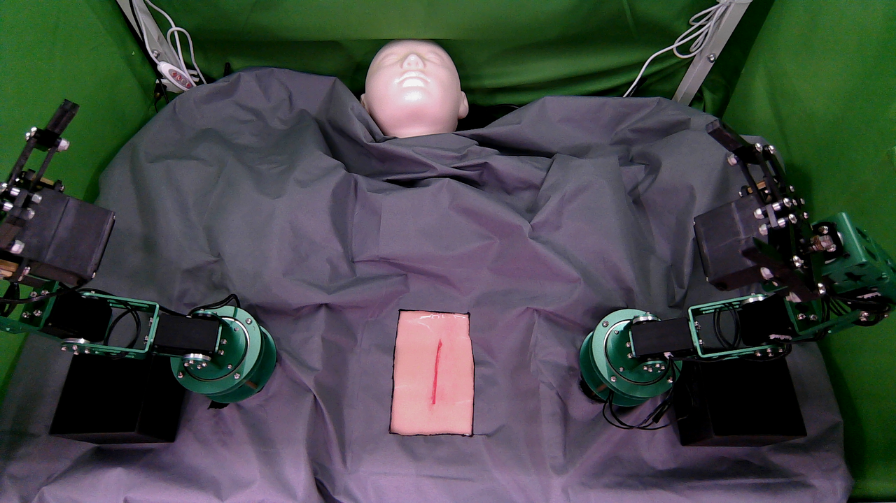</br>

**1-2. 개발 배경 및 필요성**
- **VLA 로봇의 블랙박스 문제** : 최근 VLA(Vision-Language-Action) 기반 로봇은 행동이 실제 환경에서 어떤 결과를 낼지 실행 전에 확인할 수 없습니다. 작은 오차도 조직 손상으로 이어지는 수술 환경에서는 치명적인 한계입니다.
- **기존 수술로봇의 한계** : 기존 수술로봇은 원격 조종 중심이어서 집도의의 지속적인 조작이 필요하며, 의료진의 부담을 근본적으로 줄이기 어렵습니다.
- **의료 현장의 구조적 문제** : 고령화와 필수의료 인력 부족으로 수술 현장의 업무 부담이 커지고 있어, 반복적인 보조 동작을 분담할 지능형 보조 로봇이 필요합니다.
- 따라서 본 프로젝트는 **"행동 결정 → 즉시 실행"** 사이에 **"미래 예측 → 인간 검토"** 단계를 끼워 넣어, 확인할 수 있는 반자동화 구조를 구현하였습니다.

**1-3. 프로젝트 특장점**
- **블랙박스 해소** : 로봇의 다음 행동을 월드 모델이 예측 영상으로 먼저 보여주어, 실행 전에 결과를 확인
- **예측계·제어계 분리** : 생성 영상은 판단 근거로만 쓰고 제어값으로 쓰지 않아, 생성 모델의 오류가 물리 동작으로 전달되지 않음
- **일반화된 절개 정책** : 매 에피소드마다 무작위 절개선을 부여하는 강화학습(Isaac Lab, PPO)으로, 처음 보는 절개선도 재학습 없이 수행
- **이중 안전 구조** : 3초 이내 2회 연속 승인 + 로봇 측 상태 시퀀스 검증으로 오조작·순서 오류 차단
- **실측 기반 설계** : 해상도 9종 메모리 스윕, base vs LoRA 대조군 생성 등 모든 설계 결정을 실측으로 확정

**1-4. 주요 기능**

<table>
  <tr>
    <td align="center"><b>① 월드 모델 행동 예측</b></td>
    <td align="center"><b>② 음성 명령 · 환경 인식</b></td>
  </tr>
  <tr>
    <td align="center">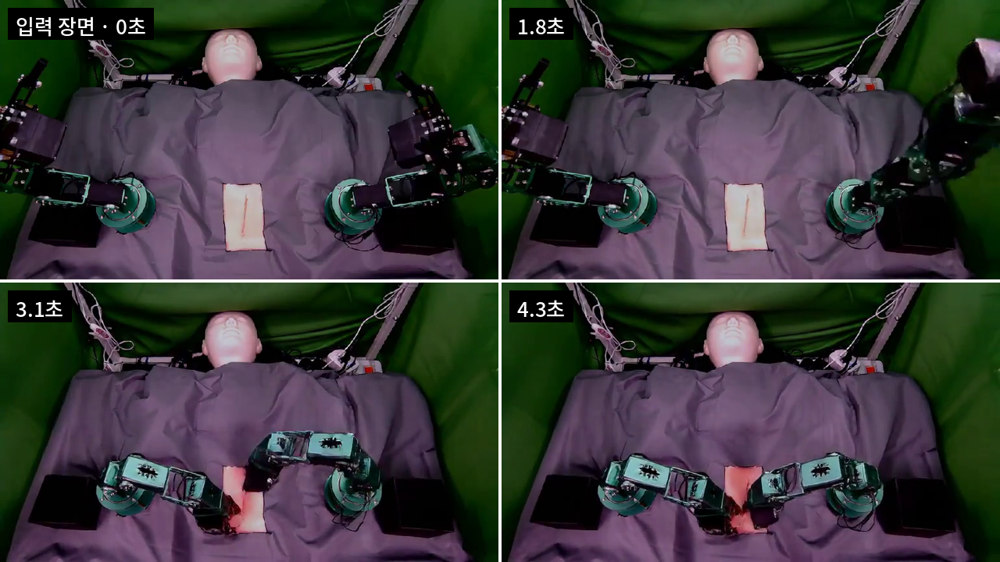</td>
    <td align="center">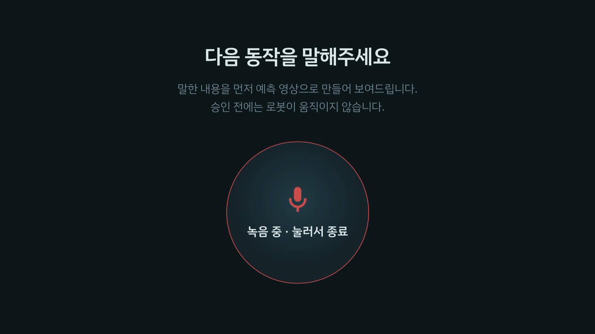</td>
  </tr>
  <tr>
    <td align="center">실촬영 데이터로 LoRA 파인튜닝한 Cosmos-Predict2.5-2B가<br>현재 수술 장면 1장으로 약 5.8초의 미래 행동 영상 생성<br>(Image2World, 960×528, 16fps, 93프레임)</td>
    <td align="center">Whisper STT로 한국어 명령을 인식해<br>절개 / 개복 / 수술 완료 3종 동작으로 분류,<br>동시에 카메라가 현재 수술 환경을 자동 촬영</td>
  </tr>
  <tr>
    <td align="center"><b>③ Human-in-the-loop 웹 승인 콘솔</b></td>
    <td align="center"><b>④ 강화학습 기반 로봇 실행</b></td>
  </tr>
  <tr>
    <td align="center">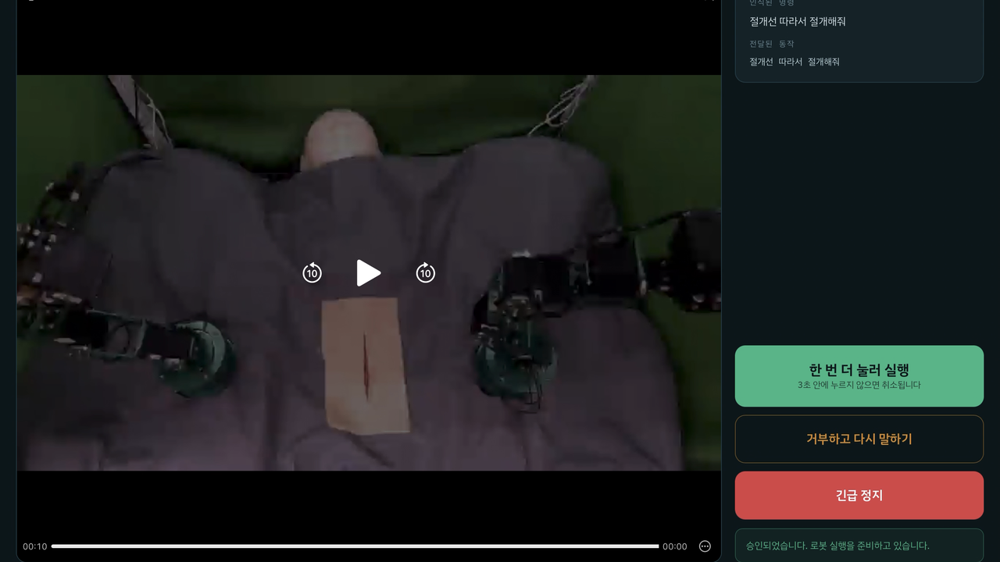</td>
    <td align="center">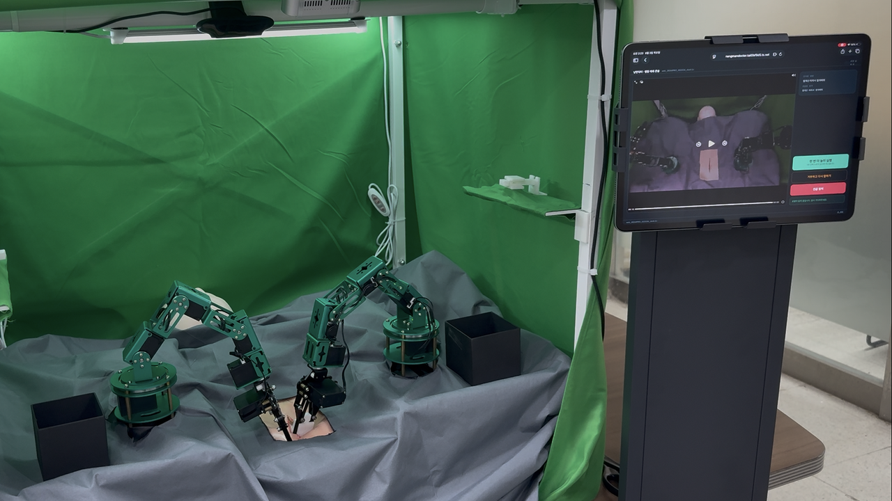</td>
  </tr>
  <tr>
    <td align="center">명령 → 생성 중 → 검토의 3화면 구조,<br>3초 이내 2회 연속 탭으로만 승인<br>(iPad Safari 실기 검증)</td>
    <td align="center">PPO 절개 정책 + Pixel→World→Robot Base 좌표 변환으로<br>양팔 DOFBOT이 절개·개복 동작을 협응 수행</td>
  </tr>
</table>

**1-5. 주요 실측 결과** <sub>(2026.9 개발보고서 기준)</sub>

| 항목 | 결과 |
|---|---|
| 월드 모델 LoRA 학습 | 528×960 · 93프레임 · rank 8, A6000 48GB에서 peak 41.5GB, loss 0.02~0.03 수렴 |
| 도메인 재현 | 파인튜닝 후 로봇팔·그린스크린·수술 시트·인공 피부 안정적 재현 (608×1104에서는 4 seed 중 2개 도메인 붕괴 → 528×960 확정) |
| 절개 정책 (PPO) | 64개 평가 환경 완주율 80~86%, 실제 도달 가능 방향 구간 94%, xy 정밀도 sub-mm |
| 좌표 보정 | 30점 Homography Calibration, 평균 재투영 오차 약 0.78 mm |
| End-to-End | 웹 → 카메라 → STT → 승인 → Jetson → DOFBOT 3종 동작 실기 검증 완료 |

> 현재 한계 : 정적인 환경 재현은 확보했지만, 절개처럼 시간적으로 변하는 동작의 재현은 학습 클립을 늘려 재검증 중입니다.

**1-6. 기대 효과 및 활용 분야**
- **기대 효과** : AI 행동을 실행 전에 시각적으로 확인하게 하여 Physical AI의 예측 가능성·설명 가능성·신뢰성 향상, 반복적인 보조 업무 분담으로 의료진 부담 완화
- **활용 분야** : 의료기관의 Human-in-the-loop 수술 보조 시스템, 새로운 수술 동작을 실제 적용 전에 검증하는 교육·검증 플랫폼, 의료취약지역 의료진 지원 및 원격 협진

**1-7. 기술 스택**

| 구분 | 사용 기술 |
|------|-----------|
| **World Model** |   `LoRA` `Image2World` |
| **Reinforcement Learning** |  `skrl` `PPO` `Sim-to-Real` |
| **Speech / LLM** |   |
| **Deep Learning** |   `BF16` |
| **Web / Server** |    |
| **Vision** |   `HSV 검출` `Homography` |
| **Embedded / Robot** |  `Yahboom DOFBOT ×2` `I2C (smbus)` |
| **Camera** | `Orbbec Gemini E (영상 생성용)` `Logitech C920 (로봇 제어용)` |
| **Languages** |   |
| **Infra** |  `RTX A6000 48GB (월드 모델)` `RTX 4090 ×2 (강화학습)` `conda` `tmux` |
| **Project Management** |   |

---

## **💡2. 팀원 소개**

| **팀장** | **멘티1** | **멘티2** | **멘티3** | **멘티4** | **멘토** |
|:---:|:---:|:---:|:---:|:---:|:---:|
| 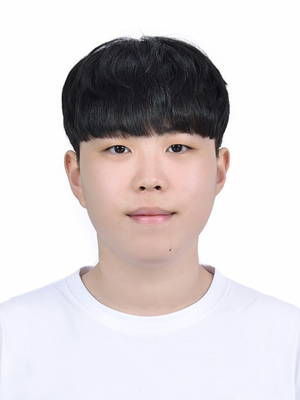 | 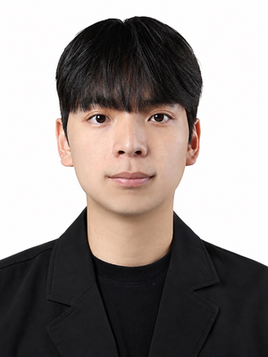 | 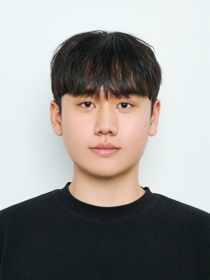 | 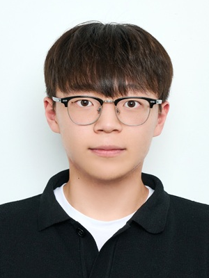 | 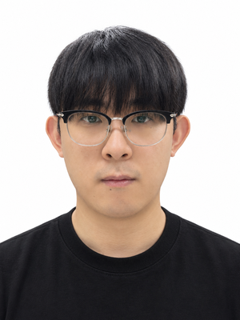 |  |
| • 통합환경 구축 <br> • 서버 연동 <br> • Jetson 연동 | • 월드모델 구성 <br> • LoRA 학습 | • 강화 학습 <br> • PPO 절개정책 | • 하드웨어 제작 <br> • 양팔 로봇 <br> • 도구 어댑터 | • 비전 인식 <br> • 절개선 검출 <br> • 좌표 보정 | • 프로젝트 멘토 <br> • 기술 자문 |
|  |  |  |  |  |  |

---

## **💡3. 시스템 구성도**

| **3-1. 서비스 흐름도** |
|---|
| [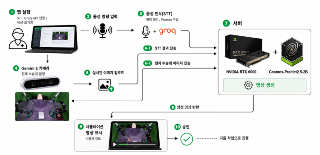](assets/diagrams/service_flow.png) |

집도의가 앱에서 음성으로 명령하면 ① Gemini E 카메라가 현재 수술대를 촬영해 서버로 올리고, ② 음성은 STT와 LLM을 거쳐 행동 프롬프트로 바뀝니다. 서버의 Cosmos-Predict2.5-2B가 두 입력으로 시뮬레이션 영상을 생성해 돌려주면, 집도의가 검토 후 **승인한 경우에만** 다음 작업(로봇 실행)으로 진행합니다.

| **3-2. S/W 구성도** |
|---|
| [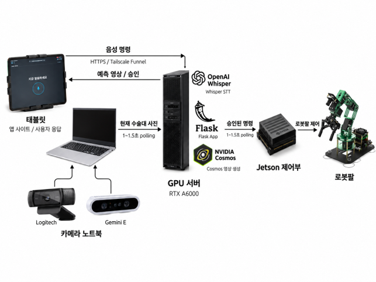](assets/diagrams/sw_architecture.png) |

시스템은 **태블릿 · 카메라 노트북 · GPU 서버 · Jetson 제어부**의 4개 노드로 나뉘어 동작합니다. 카메라 노트북과 Jetson은 외부에서 직접 접속할 수 있는 주소가 없기 때문에, 서버가 상태 파일에 명령을 **게시**하고 각 장치가 1~1.5초 주기로 이를 **조회(polling)** 해 가는 단방향 구조로 설계했습니다. 서버는 명령을 게시할 수만 있고, 실제 실행 여부는 로봇이 최종 판단합니다. 태블릿 접속은 Tailscale Funnel을 통한 HTTPS로 제공됩니다.

| **3-3. 월드 모델 흐름도** |
|---|
| [](assets/diagrams/worldmodel_flow.png) |

명령 시점에 촬영한 **정지 이미지 1장**과 음성 명령에서 변환된 **영어 행동 프롬프트**를 조건으로, 촬영 환경을 학습시킨 LoRA 어댑터(rank 8)를 얹은 Cosmos-Predict2.5-2B가 이후 동작을 예측합니다(Image2World). 결과는 960×528 · 16fps · 93프레임(약 5.8초) 영상으로 웹 콘솔에 표시됩니다.

| 계통 | 입력 | 출력 | 역할 |
|---|---|---|---|
| **예측계** | 촬영 이미지 + 행동 프롬프트 | 미래 행동 예측 영상 | 집도의 판단 지원 |
| **제어계** | 실제 카메라 관측 + 승인된 명령 | 로봇 관절 제어 명령 | 실제 DOFBOT 실행 |

> 두 계통을 잇는 것은 로봇 제어 데이터가 아니라 **집도의의 승인 신호** 하나뿐입니다. 생성 영상은 픽셀 결과물이라 실제 좌표나 깊이 정보가 아니므로, 영상 속 로봇팔 위치를 제어값으로 쓰지 않습니다.

| **3-4. H/W 구성도** |
|---|
| [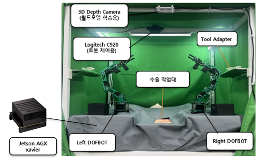](assets/diagrams/hw_architecture.png) |

- 수술대 좌우에 6축 **Yahboom DOFBOT ×2** 배치 — 우측은 Scalpel Adapter로 절개, 좌측은 조직 고정·개복 보조
- 두 DOFBOT 확장보드가 동일한 I2C 주소(0x15)를 사용하므로 Jetson의 **Bus 1(좌) / Bus 8(우)** 로 물리적으로 분리해 독립 제어
- 3D 프린팅 **Scalpel Adapter / Opening Adapter** 자체 설계 — 절개 기준점을 그리퍼 중심에서 실제 칼날 끝(Blade Tip)으로 재정의
- 카메라 역할 분리 : **Logitech C920**(상부, 절개선 검출·로봇 제어) / **Orbbec Gemini E**(측면, 월드 모델 입력·학습 데이터)
- 그린스크린 · 암막 · LED 조명으로 촬영 환경 고정 → 영상 간 차이가 로봇 행동 변화만 되도록 통제

**로봇 안전 상태 시퀀스**

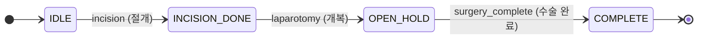

> 현재 상태에서 허용되지 않는 명령은 로봇이 자체적으로 거부합니다. 서버가 잘못된 순서의 명령을 보내더라도 실제 동작으로 이어지지 않는 이중 안전 구조입니다.

| **3-5. 엔티티 관계도** |
|---|
| [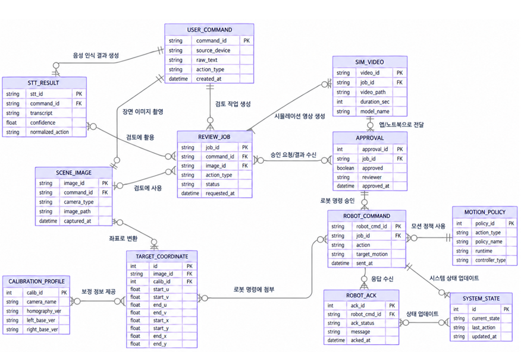](assets/diagrams/erd.png) |

하나의 음성 명령(`USER_COMMAND`)에서 STT 결과 · 장면 이미지 · 검토 작업(`REVIEW_JOB`)이 파생되고, 검토 작업에 시뮬레이션 영상(`SIM_VIDEO`)과 승인(`APPROVAL`)이 연결됩니다. 승인된 작업만 로봇 명령(`ROBOT_COMMAND`)이 되며, 로봇의 응답(`ROBOT_ACK`)이 시스템 상태(`SYSTEM_STATE`)를 갱신합니다. 장면 이미지는 캘리브레이션 정보(`CALIBRATION_PROFILE`)를 거쳐 절개 목표 좌표(`TARGET_COORDINATE`)로 변환되어 로봇 명령에 첨부됩니다.


---

## **💡4. 작품 소개영상**
> <sub>이미지를 클릭하면 유튜브 시연 영상을 보실 수 있습니다.</sub>

[](https://www.youtube.com/watch?v=k7HaMJAGI6U)

▶ 시연 영상 바로가기 : https://www.youtube.com/watch?v=k7HaMJAGI6U

---

## **💡5. 핵심 소스코드**

### 5-1. 음성 명령 인식 및 로봇 동작 분류 (`remote_realtime_listener.py`)
수술 명령은 같은 발화에 항상 같은 결과가 나와야 하므로, Whisper의 디코딩을 결정론적으로 고정했습니다.
`temperature=0.0`은 인식이 불확실할 때 온도를 올려 재시도하는 기본 동작을 막아 재현성을 확보하고, `beam_size=5`는 여러 후보 문장 중 가장 그럴듯한 것을 골라 정확도를 보완합니다.
전사 결과는 3종 동작으로 분류되며, 이 **단일 분류 결과가 예측 영상 생성과 로봇 명령 양쪽에 동일하게 쓰여** 예측계와 제어계가 같은 명령을 바라보게 됩니다.

```python
result = whisper_model.transcribe(
    str(audio_path),
    language="ko",
    beam_size=5,
    best_of=5,
    temperature=0.0,
    condition_on_previous_text=True,
)
stt_text = result["text"].strip()

# STT 결과 -> 로봇 동작 분류
if "절개" in stt_text:
    robot_action = "incision"
elif "개복" in stt_text:
    robot_action = "laparotomy"
elif ("수술 완료" in stt_text or "완료" in stt_text
      or "끝났" in stt_text or "끝나" in stt_text):
    robot_action = "surgery_complete"
else:
    write_job_status(audio_path, stage="error", stt_text=stt_text,
                     error_message="절개/개복/수술완료 명령을 인식하지 못했습니다.")
    return
```

### 5-2. 월드 모델 행동 예측 영상 생성 (`remote_realtime_listener.py`)
한국어 명령을 LLM이 Cosmos용 영어 행동 프롬프트로 바꾼 뒤, 명령 시점에 촬영한 **정지 이미지 1장**을 조건으로 미래 영상을 생성합니다(Image2World).
Video2World는 이미 움직이기 시작한 프레임을 요구하므로, "실행 전 예측 → 검토 → 승인" 구조에는 정지 장면에서 출발하는 Image2World가 맞습니다.
영상이 완전히 저장되고 웹 재생용 faststart 처리가 끝난 **뒤에만** 웹 콘솔을 검토 단계로 전환해, 덜 만들어진 영상이 승인 화면에 뜨는 일을 막습니다.

```python
response = groq_client.chat.completions.create(
    model="openai/gpt-oss-20b",
    messages=[
        {"role": "system", "content": GROQ_SYSTEM_PROMPT},
        {"role": "user",
         "content": f"Convert this Korean surgical command to Cosmos prompt: {stt_text}"},
    ],
)
cosmos_prompt = response.choices[0].message.content.strip()

gen_result = pipe(
    image=image,                 # 명령 시점의 현재 수술 장면 1장 (Image2World)
    video=None,
    prompt=cosmos_prompt,
    negative_prompt=NEGATIVE_PROMPT,
    num_frames=93,
    num_inference_steps=30,
    guidance_scale=7.0,
    height=704,
    width=1280,
    generator=torch.Generator().manual_seed(42),
)

export_to_video(gen_result.frames[0], str(out_path), fps=8)
apply_faststart(out_path)        # iPad Safari 스트리밍 대응 — review 전환보다 먼저 수행
```

> ⚠️ 위 코드는 1차 시연용 실시간 리스너(베이스 모델 파이프라인) 기준입니다. LoRA 어댑터를 적용한 학습 규격(960×528, 16fps) 추론 코드는 2차 학습 완료 후 서버 버전으로 교체 예정입니다.

> LoRA 학습 규격 : 528×960 · 93프레임 · 16fps · rank/alpha 8/8 · lr 1e-4 · BF16 · 50 epoch
> (해상도는 16의 배수여야 하며, 위반 시 OOM이 아닌 `RuntimeError: reshape`가 발생함을 실측으로 확인)

### 5-3. 2단계 승인 (`web_console/templates/job.html`)
장갑 착용이나 오접촉에 의한 우발적 실행을 막기 위해, 첫 탭은 "장전(armed)"만 하고 **3초 안에 한 번 더** 눌러야 승인 요청이 전송됩니다. 3초가 지나면 자동으로 해제됩니다.

```javascript
let armed = false;
let armTimer = null;

approveBtn.addEventListener('click', () => {
  if (!armed) {
    armed = true;                       // 1회차: 장전만
    approveBtn.classList.add('arm');
    approveTxt.innerHTML = '한 번 더 눌러 실행<small>3초 안에 누르지 않으면 취소됩니다</small>';
    armTimer = setTimeout(() => {       // 3초 경과 시 자동 해제
      armed = false;
      approveBtn.classList.remove('arm');
      approveTxt.innerHTML = '이 동작 승인<small>탭하면 한 번 더 확인합니다</small>';
    }, 3000);
  } else {
    clearTimeout(armTimer);             // 2회차: 실제 승인
    armed = false;
    approveBtn.classList.remove('arm');
    decide('approve');
  }
});
```

### 5-4. 승인 명령 게시 및 Jetson ACK 동기화 (`web_console/app.py`)
서버는 로봇을 직접 호출하지 않고, 승인된 명령을 `command.json`에 **게시**만 합니다. Jetson이 이를 주기적으로 조회해 가져가고, 실행 결과를 `job_id`와 함께 ACK로 돌려줍니다.
- 승인마다 **새 고유 job_id**를 발급해, 같은 동작을 다시 승인해도 명령이 정상 갱신되도록 했습니다.
- 임시 파일에 쓴 뒤 `os.replace`로 **원자적 치환**하여, Jetson이 반쯤 쓰인 파일을 읽는 상황을 배제했습니다.
- ACK의 `job_id`가 현재 명령과 다르면 `409`로 거부해, 오래된 응답이 최신 상태를 덮어쓰지 못하게 했습니다.

```python
def write_robot_command(job_id: str, action: str):
    """승인할 때마다 항상 새로운 고유 job_id로 명령을 생성한다."""
    unique_job_id = f"{job_id}_{uuid.uuid4().hex[:8]}"
    data = {
        "job_id": unique_job_id,
        "source_job_id": job_id,
        "action": action,
        "status": "approved",
        "consumed": False,
        "created_at": datetime.now().isoformat(),
    }
    tmp = ROBOT_COMMAND_PATH.with_suffix(".tmp")
    with open(tmp, "w", encoding="utf-8") as f:
        json.dump(data, f, ensure_ascii=False, indent=2)
    os.replace(tmp, ROBOT_COMMAND_PATH)          # 원자적 치환
    return data


@app.route("/robot/command", methods=["GET"])
def api_robot_command():
    return jsonify(read_robot_command())         # Jetson이 주기적으로 조회


@app.route("/robot/ack", methods=["POST"])
def api_robot_ack():
    body = request.get_json(silent=True) or {}
    job_id = body.get("job_id")
    data = read_robot_command()

    if not job_id or data.get("job_id") != job_id:
        return jsonify({"ok": False, "error": "job_id mismatch"}), 409

    data["consumed"] = True
    data["status"] = body.get("status", "done")
    # ... 원래 웹 job 상태에도 robot_status 반영 후 원자적 저장
```

### 5-5. 촬영 요청 브리지의 경쟁 상태 처리 (`capture_bridge/capture_bridge.py`)
녹음 시작·종료에 카메라 START/STOP이 자동 연동됩니다. 실기 테스트에서 "녹음은 끝났는데 녹화가 계속되는" 버그가 있었는데, 첫 프레임 업로드 완료 처리가 그 사이에 들어온 **STOP 요청을 덮어쓰는** 경쟁 상태(race condition)가 원인이었습니다.
현재 명령이 실제로 START 처리 중일 때만 상태를 갱신하도록 수정해 해결했습니다.

```python
def save_captured_image(job_id, file_storage):
    save_path = os.path.join(CAPTURES_DIR, f"{job_id}.png")
    file_storage.save(save_path)

    cmd = read_capture_command()

    # 이미지 업로드가 끝나는 동안 같은 job_id의 STOP 요청이 들어올 수 있다.
    # 이때 STOP(pending)을 done으로 덮어쓰면 카메라 클라이언트가 STOP을 놓친다.
    # 따라서 현재 명령이 실제 START 처리 중일 때만 START를 done으로 변경한다.
    if (
        cmd.get("job_id") == job_id
        and cmd.get("action") == "start"
        and cmd.get("status") == "running"
    ):
        cmd["status"] = "done"
        cmd["saved_path"] = save_path
        cmd["completed_at"] = _now()
        write_capture_command(cmd)

    elif (
        cmd.get("job_id") == job_id
        and cmd.get("action") == "stop"
        and cmd.get("status") == "pending"
    ):
        # STOP 요청이 이미 들어온 상태면 절대 덮어쓰지 않는다.
        ...
```

---

## **📁 레포지토리 구조**

```
26_HC122
├── assets/          # README 이미지, 구성도, 시연 영상 썸네일
├── configs/         # 학습·추론 설정
├── data/            # 샘플 데이터 (원본 영상·체크포인트는 용량 문제로 미포함)
├── docs/            # 제안서, 서버 매뉴얼, 회의록, 참고 문헌
├── jetson/          # Jetson 로봇 제어 (ros2_ws)
├── notebooks/       # 실험 노트북
├── results/         # 실험 결과 요약
├── scripts/         # 환경 점검 스크립트
├── server/          # GPU 서버 실행 환경
└── src/             # 데이터셋 · 모델 · 비전 · 시뮬레이션 · 웹 API 등 모듈
```

---

## **📚 참고 문헌**
- NVIDIA et al. "Cosmos World Foundation Model Platform for Physical AI." arXiv:2501.03575 (2025).
- Ho, J., Jain, A., Abbeel, P. "Denoising Diffusion Probabilistic Models." arXiv:2006.11239 (2020).
- Hu, E. J. et al. "LoRA: Low-Rank Adaptation of Large Language Models." arXiv:2106.09685 (2021).
- Radford, A. et al. "Robust Speech Recognition via Large-Scale Weak Supervision." arXiv:2212.04356 (2022).
- Schulman, J. et al. "Proximal Policy Optimization Algorithms." arXiv:1707.06347 (2017).
- Mittal, M. et al. "Isaac Lab: A GPU-Accelerated Simulation Framework for Multi-Modal Robot Learning." arXiv:2511.04831 (2025).

**사용 오픈소스** : [NVIDIA Cosmos](https://github.com/nvidia-cosmos) · [OpenAI Whisper](https://github.com/openai/whisper) (MIT) · [Isaac Lab](https://github.com/isaac-sim/IsaacLab) (BSD-3) · [Hugging Face Diffusers](https://github.com/huggingface/diffusers)
